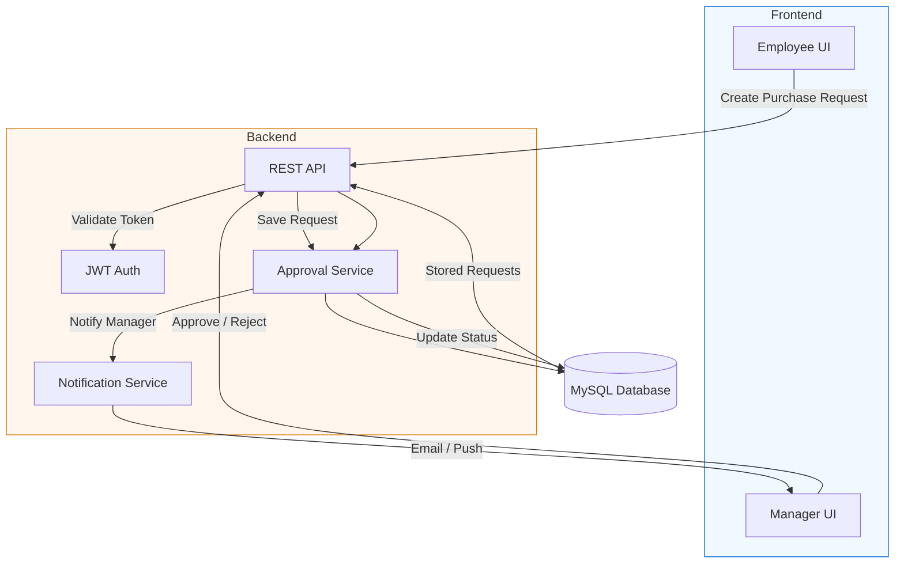

# Project Workflow — Purchase Order Approval System

This diagram summarizes the project, the core problem statement, and the approval workflow.

**Problem (summary):** Manual purchase requests and approvals cause delays, lack traceability, and make audits hard. This system automates request submission, role-based approvals, and notifications.

## Pictorial Workflow

## How this ties to the project

- **Frontend:** React app provides `CreateRequest`, `EmployeeDashboard`, `ManagerDashboard`, `Login`, and `Register` pages.
- **Backend:** Spring Boot app exposes REST endpoints, enforces JWT-based auth, and contains services and repositories for requests and approvals.
- **Database:** MySQL stores purchase requests, user roles, and approval history.

View the problem statement for more detail: [docs/Problem_Statement.md](docs/Problem_Statement.md)

---
If you want, I can also export this diagram to `docs/Workflow.svg` or `docs/Workflow.png` for easy viewing.
